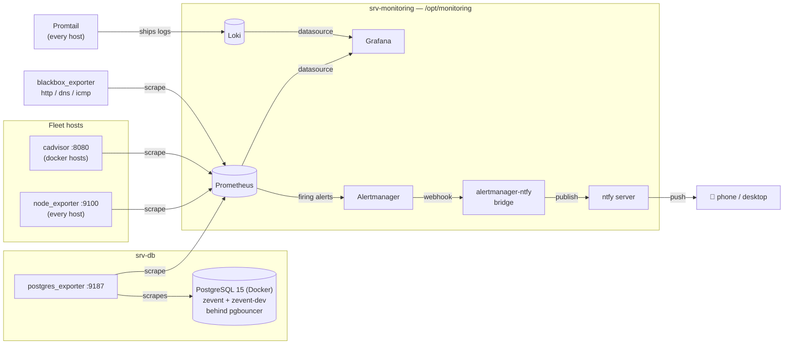

# zevent-monitoring-infra

Version-controlled snapshot of the monitoring stack running on **srv-monitoring**
(`/opt/monitoring`): metrics, logs, dashboards, and alerting for the whole
fleet, plus dedicated coverage for the **zevent** project.


## Table of Contents

- [Overview](#overview)
- [Architecture](#architecture)
- [Tech Stack](#tech-stack)
- [Repository Structure](#repository-structure)
- [Monitored Targets](#monitored-targets)
- [zevent Dashboards](#zevent-dashboards)
- [Alert Rules](#alert-rules)
- [Alerting Pipeline](#alerting-pipeline)
- [Deployment](#deployment)
- [Secrets](#secrets)
- [Source of Truth](#source-of-truth)

## Overview

This stack does four jobs:

1. **Collects metrics** — host-level (CPU/RAM/disk/load) via `node_exporter`
   on every fleet host, container-level via `cadvisor`, and PostgreSQL-level
   via `postgres_exporter` for the zevent project's databases.
2. **Probes reachability** — `blackbox_exporter` runs HTTP, DNS, and ICMP
   checks against services and hosts, independent of whether their own
   exporter is up.
3. **Visualizes** — Grafana, provisioned entirely as code: one dashboard per
   fleet host, an infrastructure overview, and environment-scoped dashboards
   for zevent (dev/prod).
4. **Alerts** — Prometheus evaluates rules and hands firing alerts to
   Alertmanager, which routes them through a bridge into ntfy for push
   notifications.

## Architecture



## Tech Stack

| Component | Role |
|---|---|
| **Prometheus** | Metrics collection, rule evaluation |
| **Grafana** | Dashboards, provisioned entirely as code |
| **Alertmanager** | Alert routing/grouping/dedup |
| **alertmanager-ntfy** | Translates Alertmanager's webhook schema into ntfy's publish API |
| **ntfy** | Push notifications (self-hosted, `ntfy.thoutmose.me`) |
| **Loki + Promtail** | Log aggregation |
| **blackbox_exporter** | HTTP / DNS / ICMP synthetic probes |
| **node_exporter** | Host-level metrics (CPU, RAM, disk, load, network) |
| **cadvisor** | Per-container metrics |
| **postgres_exporter** | PostgreSQL metrics (zevent project) |
| **Docker Compose** | Runs the whole srv-monitoring stack |

## Repository Structure

```
.
├── docker-compose.yml              # prometheus, grafana, alertmanager, ntfy, loki, blackbox-exporter, ...
├── prometheus.yml                  # scrape configs — 9 jobs, see Monitored Targets
├── alert_rules.yml                 # 2 groups, 16 rules — see Alert Rules
├── alertmanager.yml                # routing: default → ntfy, Watchdog → dead-man's-switch
├── alertmanager-ntfy.yml           # webhook → ntfy translation + notification templates
├── blackbox.yml                    # http_2xx / dns_udp / icmp probe modules
├── ntfy-server.yml                 # ntfy server config (auth, metrics)
├── loki-config.yml                 # log storage config
├── postgres_exporter_queries.yml   # custom metric: pg_max_connections (deployed to srv-db)
└── grafana/provisioning/
    ├── datasources/                # Prometheus, Loki
    └── dashboards/
        ├── dashboards.yml          # 3 providers: Infrastructure, Nodes, zevent
        └── json/
            ├── infrastructure/     # fleet-wide overview, containers, probes
            ├── nodes/              # 11 dashboards, one per host
            └── zevent/             # zevent-dev, zevent-prod
```

## Monitored Targets

**Hosts** (`node_exporter`, all on port 9100): `srv-dev`, `srv-staging`,
`srv-prod`, `srv-db`, `srv-linux`, `srv-services`, `srv-vaultwarden`,
`srv-npm`, `srv-monitoring`, `srv-agentic`, `srv-adguard`.

**Ping** (`blackbox_exporter`, ICMP): `srv-dev`, `srv-prod`, `srv-db`.

**PostgreSQL** (`postgres_exporter` on srv-db, port 9187): the zevent
project's Postgres instance — Docker container `zevent-database-postgres-1`,
host port `55432`, databases `zevent` (prod) and `zevent-dev` (dev), fronted
by pgbouncer for application traffic. The exporter connects directly,
bypassing pgbouncer.

**HTTP/DNS probes**: Vaultwarden, NPM admin, AdGuard admin, ntfy health,
Grafana, plus AdGuard's DNS resolver.

## zevent Dashboards

| Dashboard | Scope |
|---|---|
| **zevent: Dev** | `srv-dev` host metrics + `srv-db` host metrics + `zevent-dev` database |
| **zevent: Prod** | `srv-prod` host metrics + `srv-db` host metrics + `zevent` database |

Each is a single self-contained view (32 panels) rather than split across
folders: host status/ping/CPU/RAM/load/swap/disk-by-mountpoint/disk-I/O/
network for both the app host and srv-db, then database status/size/
connections/TPS/cache-hit-ratio/deadlocks for that environment's database.

## Alert Rules

**`fleet`** (12 rules, applies to every host): `InstanceDown`,
`HostHighCpuLoad`, `HostOutOfMemory`, `HostOutOfDiskSpace`, `HostHighLoad`,
`HostReboot`, `HostRebootRequired`, `HostAptUpgradesPending`, `CadvisorDown`,
`ProbeFailure`, `ProbeSlowResponse`, `Watchdog` (dead-man's-switch heartbeat).

**`zevent-postgres`** (4 rules, scoped to `datname=~"zevent.*"`):

| Alert | Condition | Severity |
|---|---|---|
| `PostgresDown` | `pg_up == 0` for 2m | critical |
| `PostgresConnectionsHigh` | connections > 80% of `max_connections` for 5m | warning |
| `PostgresDeadlocks` | any deadlock in a 5m window | warning |
| `PostgresLowCacheHitRatio` | cache hit ratio < 90% for 15m | info |

## Alerting Pipeline

```
Prometheus (rule fires)
  → Alertmanager (groups/dedups, routes by label)
  → alertmanager-ntfy bridge (translates webhook schema)
  → ntfy (publishes to topic "alerts")
  → push notification
```

`Watchdog` always fires and is routed separately, with a short
`repeat_interval`, to ping an external dead-man's-switch — the only way to
detect srv-monitoring itself going dark, since every other rule in this repo
can only alert about targets *other than* the box it runs on.

## Deployment

```bash
cd /opt/monitoring
docker compose up -d
```

Fill in the `CHANGEME` placeholders (see [Secrets](#secrets)) before a fresh
deploy. `postgres_exporter` runs separately, directly on srv-db (not in this
compose file) — see `postgres_exporter_queries.yml` for the custom-metrics
config it loads from `/etc/prometheus-postgres-exporter/queries.yaml`.

## Secrets

Every credential in this repo has been replaced with `CHANGEME`: Grafana
admin password, Alertmanager→ntfy-bridge basic auth, ntfy publish auth,
AdGuard exporter password. Fill in real values in a local copy before
deploying — **never commit real secrets here**.

## Source of Truth

Several files carry comments referencing `.j2` templates and an Ansible
`monitoring` role (e.g. `docker-compose.yml.j2`, `prometheus.yml.j2`) — this
repo is a snapshot of the **deployed, rendered output**, not that Ansible
source. If an Ansible control repo exists elsewhere, treat that as canonical
and mirror changes made here back into it, or the next `ansible-playbook` run
will overwrite what's deployed.
